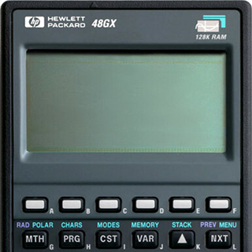

# jsEmu48
SDL Emscripten compatible Fork version of HPEMU by Daniel Nilsson

Demo: [http://jmapp.com/jsemu48/](https://jmapp.com/jsemu48/)

* Dependencies: SDL2 + TTF + IMAGE
https://www.libsdl.org/projects/SDL_ttf/
https://www.libsdl.org/download-2.0.php
https://www.libsdl.org/projects/SDL_image/

* Install Emscripten
git clone https://github.com/emscripten-core/emsdk
cd emsdk
./emsdk install latest
./emsdk activate latest
source ./emsdk_env.sh

* Compile js version
make js

* Serve js version locally (needs ruby)
make js-serve
Visit http://localhost:9999/

* To build the desktop version
make

CREDITS

HP EMU 0.9
https://sourceforge.net/projects/hpemu/files/hpemu/

Visit my HP48 page : https://www.hpcalc.org/authors/8
